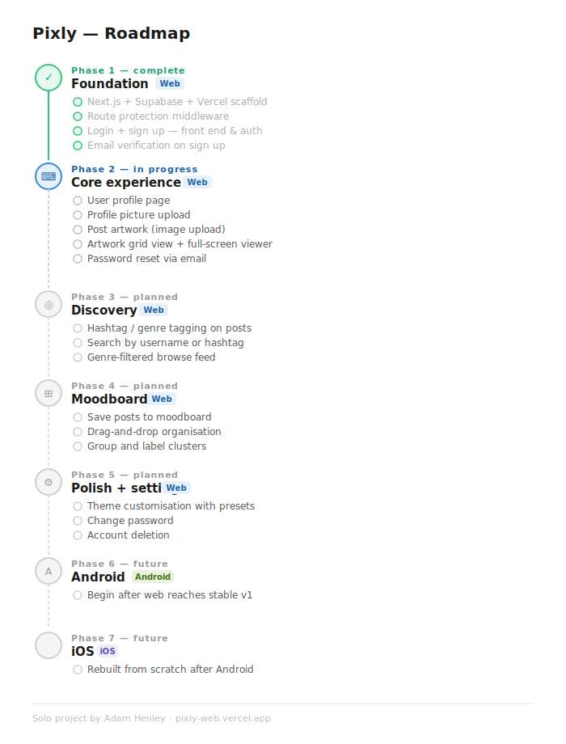

# Pixly

> *Your art. Your space. Your audience.*

Pixly is a portfolio platform built exclusively for artists — a dedicated space where your work isn't buried under fitness posts, trending topics, or content that has nothing to do with art.

Whether you're a digital illustrator, photographer, traditional painter, or anything in between, Pixly gives you a clean, customisable profile to showcase your work the way you want it seen. Search by genre, discover artists in your field, and build a moodboard of inspiration from the community around you.

**No noise. Just art.**

---

## About

Pixly started as an A-Level Computer Science NEA and has since grown into a long-term personal project. The goal is a fully cross-platform experience — web first, then Android and iOS.

Built solo by [@AdamHenley1](https://github.com/AdamHenley1)

🔗 [pixly-web.vercel.app](https://pixly-web.vercel.app)

---

## Features

- **Genre-tagged posts** — your work reaches the right eyes
- **Customisable profiles** — actually reflects your style
- **Moodboard tools** — collect, organise, and draw inspiration from work you love
- **Unique username system** — always findable, always distinct

---

## Roadmap

